**Vehicle Detection Project**

The goals / steps of this project are the following:

* Perform a Histogram of Oriented Gradients (HOG) feature extraction on a labeled training set of images and train a classifier Linear SVM classifier
* Optionally, you can also apply a color transform and append binned color features, as well as histograms of color, to your HOG feature vector. 
* Note: for those first two steps don't forget to normalize your features and randomize a selection for training and testing.
* Implement a sliding-window technique and use your trained classifier to search for vehicles in images.
* Run your pipeline on a video stream (start with the test_video.mp4 and later implement on full project_video.mp4) and create a heat map of recurring detections frame by frame to reject outliers and follow detected vehicles.
* Estimate a bounding box for vehicles detected.

## [Rubric](https://review.udacity.com/#!/rubrics/513/view) Points
###Here I will consider the rubric points individually and describe how I addressed each point in my implementation.  

---

All my code is in `detection.py`

### Histogram of Oriented Gradients (HOG)

#### 1. Explain how (and identify where in your code) you extracted HOG features from the training images.

The code for this step is contained in the `extract_feature` function in `detection.py` on 
lines 57-63.

I started by reading in all the `vehicle` and `non-vehicle` images.  Here is an example of one of each of the `vehicle` and `non-vehicle` classes:

Vehicle                  |  Undistorted
:----------------------------:|:------------------------------:
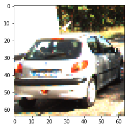| 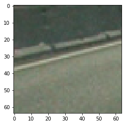

I then explored different color spaces and different `skimage.hog()` parameters (`orientations`, `pixels_per_cell`, and `cells_per_block`).  I grabbed random images from each of the two classes and displayed them to get a feel for what the `skimage.hog()` output looks like.

Here is an example using HOG parameters of `orientations=8`, `pixels_per_cell=(8, 8)` and `cells_per_block=(2, 2)`:

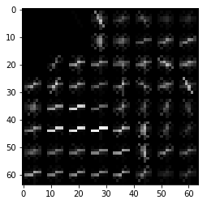

#### 2. Explain how you settled on your final choice of HOG parameters.

I tried various combinations of parameters and looked at the validation set accuracy
of my SVM classifier:

Color Space  |  Orient  | pix_per_cell | cell_per_block | accuracy
:-----------:|:--------:|:------------:|:--------------:|:-----------:
YUV | 9 | 8 | 2 | 97%
YUV | 8 | 8 | 2 | 98%
RGB | 9 | 8 | 2 | 97%
RGB | 8 | 8 | 2 | 98%
YCrCb | 9 | 8 | 2 | 99%
YCrCb | 8 | 8 | 2 | 98%
YCrCb | 7 | 8 | 2 | 98%

However, the accuracy was already very high with default parameters and out of the 
box linear SVM so I did not feel compelled to explore that much more. I ended up just using `YCrCb`, `orient=9`, `pix_per_cell=8`, and `cell_per_block=2`. 

#### 3. Describe how (and identify where in your code) you trained a classifier using your selected HOG features (and color features if you used them).

I trained a linear SVM by creating a  training set from the given vehicle and non vehicle images. Since both datasets had around 9000 images, I did not need to balance the classes.
I shuffled the data and split 20% into a validation set and 80% into a training set.

To extract features I used spatial binning, color histograms and HOG features. I concatenated
them into a large feature vector and used `sklearn.StandardScaler` to normalize my data. I fed
this data into the svm classifier and used default parameters.

###Sliding Window Search

#### 1. Describe how (and identify where in your code) you implemented a sliding window search.  How did you decide what scales to search and how much to overlap windows?

The logic for my sliding window search is contained in `slide_window` and `generate_windows`
method on lines 156-203.

First, I restricted the range of pixels to slide my windows to the bottom half of the image
because that is where the road is and where I expect to find images. Initially I slide 
my 64x64 windows with a 75% overlap. I found that by increasing the overlap from 50% to 75%
I was able to find more "hot windows" and made my heatmaps stronger downstream. 

However, I found that my bounding boxes were too small for some of my images (like when the car is too close to the camera). So I did the same process but with larger windows (128x128 sliding windows and 160x160 windows sliding windows) to
detect these larger subimages. 

In short, I used 3 scales (64x64, 128x128, and 160x160 windows)

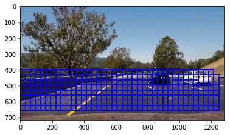

#### 2. Show some examples of test images to demonstrate how your pipeline is working.  What did you do to optimize the performance of your classifier?

Ultimately I searched on three scales using YCrCb 3-channel HOG features plus spatially binned color and histograms of color in the feature vector, which provided a nice result.  Here are some example images:

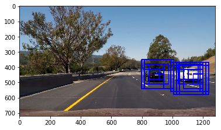

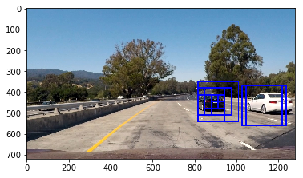

---

### Video Implementation

####1. Provide a link to your final video output.  Your pipeline should perform reasonably well on the entire project video (somewhat wobbly or unstable bounding boxes are ok as long as you are identifying the vehicles most of the time with minimal false positives.)

Here's a [link to my video result](./video.mp4)

####2. Describe how (and identify where in your code) you implemented some kind of filter for false positives and some method for combining overlapping bounding boxes.

I recorded the positions of positive detections in each frame of the video.  From the positive detections I created a heatmap and then thresholded that map to identify vehicle positions.  I then used `scipy.ndimage.measurements.label()` to identify individual blobs in the heatmap.  I then assumed each blob corresponded to a vehicle.  I constructed bounding boxes to cover the area of each blob detected.  

Here's an example result showing the heatmap from a series of frames of video, the result of `scipy.ndimage.measurements.label()` and the bounding boxes then overlaid on the last frame of video.

Here is a a video frame and its corresponding heatmap, label and bounding box images:

Image                 |  Heatmap     | label() function | Bounding Box
:--------------------:|:------------:|:----------------:|:--------------:
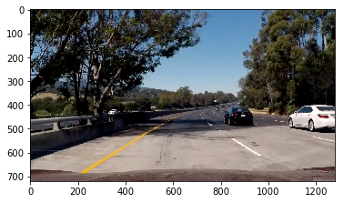| 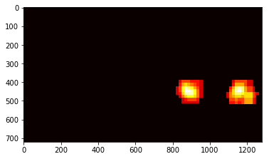 | 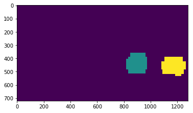 | 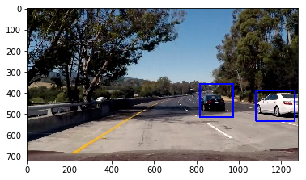
| 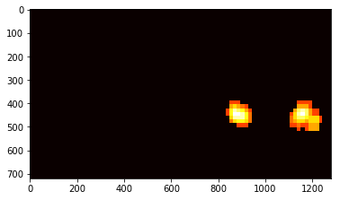 |  | 
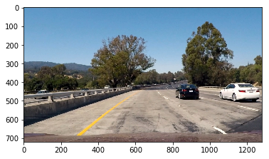| 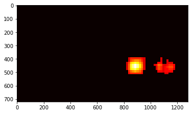 | 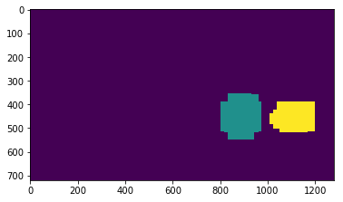 | 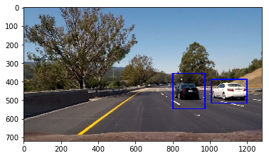

Additionally, to deal with false positives I kept track of heatmaps from previous frames. I maintain
a deque of heatmaps from the past 5 frames and add them together to get the "final heatmap" (see `generate_heatmap()` on lines 219-231).
I then apply a threshold to this cumulative total.

---

###Discussion

####1. Briefly discuss any problems / issues you faced in your implementation of this project.  Where will your pipeline likely fail?  What could you do to make it more robust?

This project is mainly made of two parts: (1) train an SVM classifier to detect vehicle or non vehicle
and (2) implement a sliding window technique to search for vehicles in the frame.

For me step (1) was relatively straightforward since SVM works out of the box. Step (2) was more difficult for me.

The biggest issue with my pipeline is that I have to recompute HOG features for every sliding window. I did not use the technique described
in the lecture to compute the HOG features once on the whole image and then subsample that. This makes it so it takes 1-2s to process
every frame. 

This is a problem because the latency is very high, but also more importantly it limits how many sliding windows I can do. 
I found that using smaller sliding windows with more overlap helps detect vehicles better and thus improves the reliability
of my heatmaps. This would give me more flexibility in how I set thresholds and maintain a cumulative total over previous frames as discussed above. However, because of the computational burden I can only search through so many windows before processing time takes 
too much time.

In my video, my pipeline has a few false positives and drops off in a few places. I t hink that if I had the flexibility to use more granular sliding windows (more overlap and smaller window size) I could detect a lot more true and false positives. And then I could increase
my threshold level to remove false positives.
